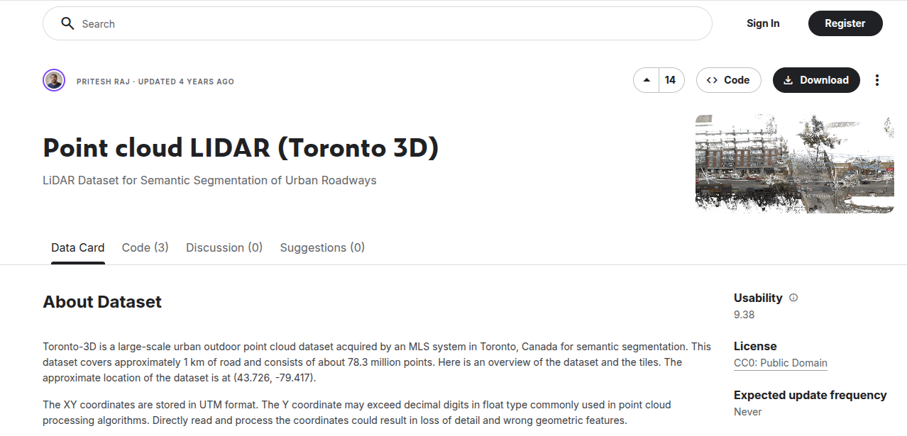
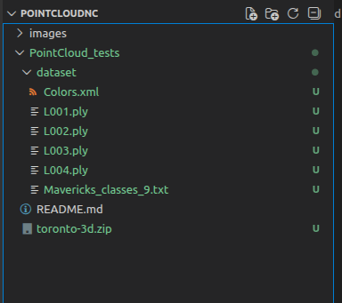

# PointCloud_tests

## Setup Conda Env
Tested on linux terminal:

```bash

# Create a new conda environment specifically for point cloud processing
conda create -n pointcloud_env python=3.10 -y

# Activate the newly created environment
conda activate pointcloud_env

# Install JupyterLab for our notebook environment
conda install -c conda-forge jupyterlab -y

# Install core data science and machine learning libraries
conda install -c conda-forge numpy pandas scikit-learn matplotlib -y

# Install essential point cloud processing libraries
conda install -c conda-forge open3d laspy pdal python-pdal -y

```

## Working on Jupyter-Notebook
Run with `jupyther-lab` command.

### Download an example dataset: Toronto-3D

**Step 1:** Link to download the dataset: https://www.kaggle.com/datasets/priteshraj10/point-cloud-lidar-toronto-3d

  

**Step 2:** Unzip and rename as below:

  


### Data I/O & Visualization Tests

Take a look: `01_data_exploration.ipynb`

But first don't forget to download dataset as above.

#### Example import

 